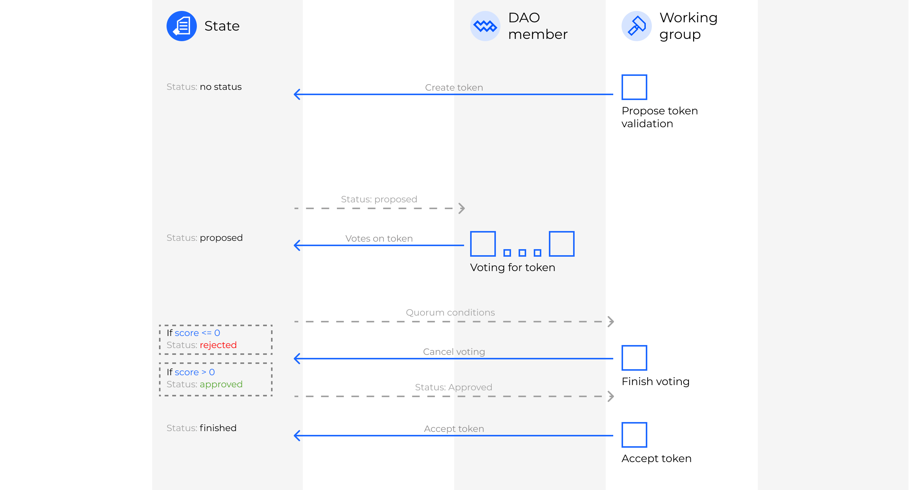

# Special Votings on token verification

Integrated with Waves.Exchange service. This smart contract verifies new tokens on Waves.Exchange by means of voting. 

**The Workflow**

1. **WG**: proposes token validation
2. **DM**: votes on token validation
3. **WG**: finishes voting and makes final decision

--> *token approved*

**Abbreviations:** 
WG - Working Group  
DM - DAO Member

